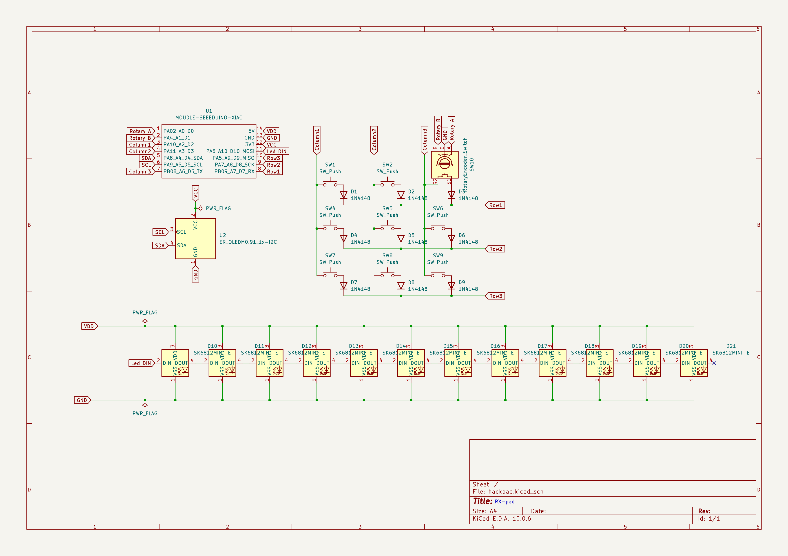
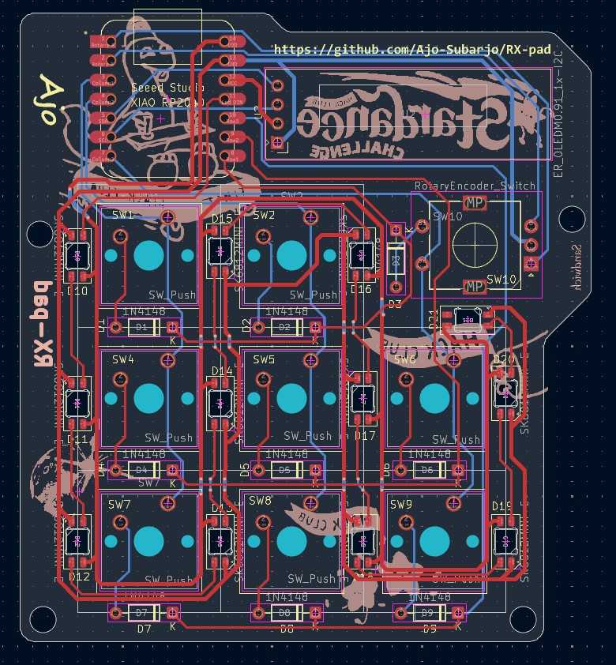
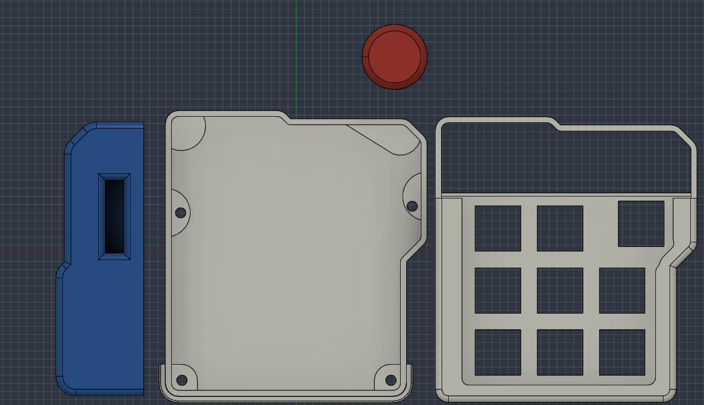
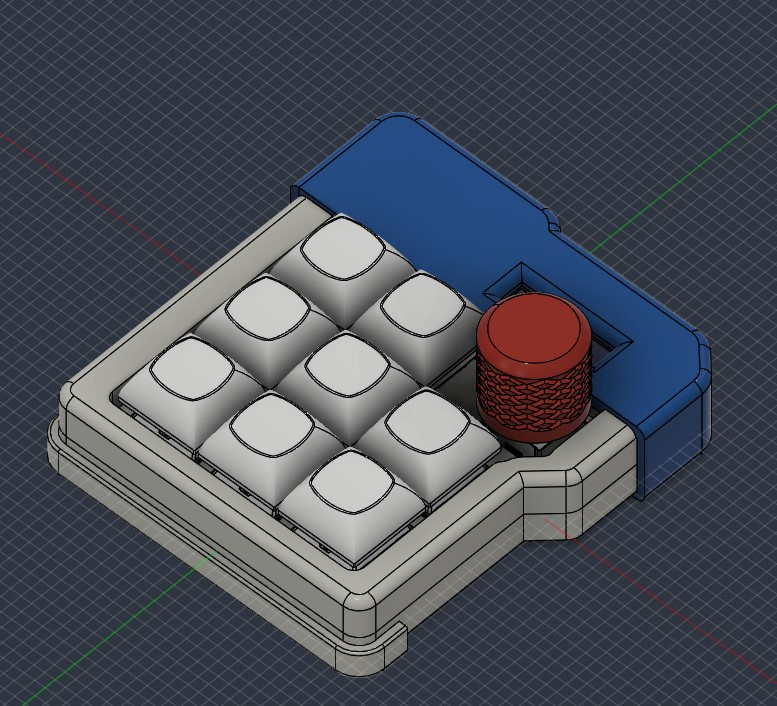

# RX-pad

A custom 3×3 macropad built with a seed xiao rp2040 and KMK firmware.

The macropad includes media controls, and soon will adding blender shortcut layer, a rotary encoder for volume control, an OLED display, and RGB LEDs.

## Features

* 3×3 key matrix  (if the switch in encoder count)
* Media controls
  * Previous track
  * Next track
  * Play/Pause
  * Stop
  * Mute
* Function layer
  * F1–F8
    
* Rotary encoder
  * Clockwise → Volume Up
  * Counter-clockwise → Volume Down
* 128×32 I2C OLED
* 12 NeoPixel LEDs
* Layer switching with a dedicated key
* KMK firmware

### Schematic

### Pcb

### Case

### overall look

## BOM:
* Seeed XIAO RP2040
* 9x through-hole 1N4148 Diodes
* 8x MX-Style switches
* 1x EC11E Rotary encoders (with switch!)
* 1x 0.91 inch OLED display
* 8x keycaps
* 12x SK6812 MINI-E LEDs
* 4x M3x16mm screws
* 4x M3x5mx4mm heatset inserts
* 4 3D printed parts
